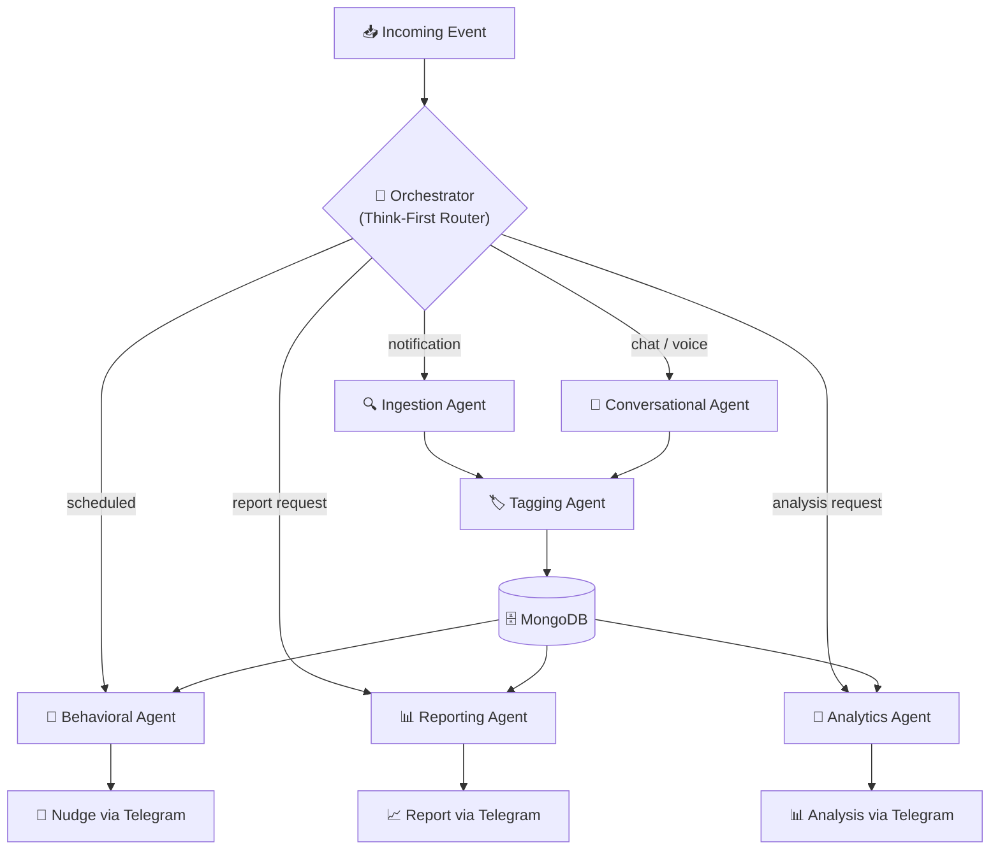
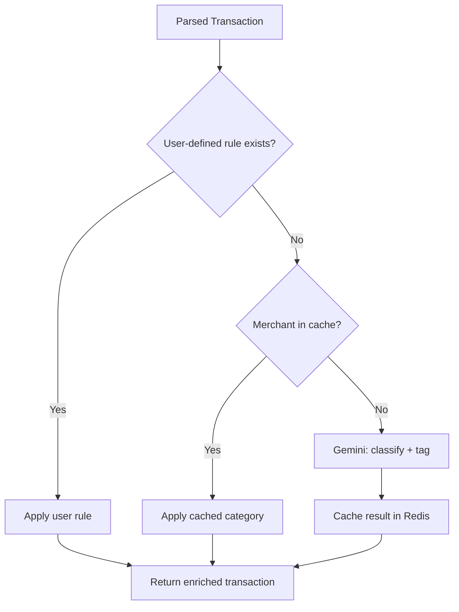

# ChiWi — Multi-Agent System

## Overview

ChiWi operates as a **swarm of 6 specialized AI agents**, each with a distinct system prompt, toolset, and responsibility. The agents are orchestrated by a central **Orchestrator** that follows a **"Think-First"** routing pattern.

**Mobile / backend split:** The Android app (separate repository) is a sensor — it captures raw bank notification text and forwards it verbatim to `POST /api/webhook/notification`. All AI logic (parsing, tagging, behavioral analysis, reporting) runs on the backend. This means parsing bugs can be fixed with a server deploy, never a mobile release.

## Orchestration Model



### Think-First Routing

The Orchestrator classifies each incoming event before dispatching:

| Event Type | Route | Agent Pipeline |
|---|---|---|
| Android notification webhook | `notification` | Ingestion → Tagging → Store |
| Telegram text message | `chat` | Conversational → Tagging → Store |
| Telegram voice message | `voice` | Conversational (STT) → Tagging → Store |
| Scheduled cron trigger | `scheduled` | Behavioral → Nudge |
| User report request | `report` | Reporting → Telegram |
| User analysis request | `analysis` | Analytics → Telegram |
| Edit callback button | `correction` | Direct DB update + learn |

---

## Agent Specifications

### 1. Ingestion Agent (The Collector)

| Property | Value |
|---|---|
| **File** | `src/agents/ingestion.py` |
| **LLM** | Gemini 2.5 Flash |
| **Trigger** | `POST /api/webhook/notification` from Android app |
| **Input** | Raw bank notification text (PII-masked) + optional bank hint |
| **Output** | Structured `ParsedTransaction` |

**Responsibilities**:
- Filter noise (non-financial notifications) — returns `is_transaction: false`
- Extract: amount, currency, direction (inflow/outflow), merchant name, timestamp
- Handle Vietnamese bank notification formats (VCB, TCB, MBBank, ACB, MoMo, etc.)

**Why server-side:** Parsing logic can be improved (prompt edits, new bank formats) with a backend deploy only — the Android app never needs to be updated for parsing changes.

---

### 2. Conversational Agent (The Interface)

| Property | Value |
|---|---|
| **File** | `src/agents/conversational.py` |
| **LLM** | Gemini 2.5 Pro |
| **Trigger** | Telegram text or voice message |
| **Input** | Natural language message + conversation history |
| **Output** | Structured transaction OR conversational response |

**Responsibilities**:
- Maintain ChiWi's persona (friendly, Vietnamese, finance-savvy)
- Resolve temporal references ("hôm qua", "thứ 6 tuần trước")
- Parse informal Vietnamese amounts ("50k", "2 củ", "trăm rưỡi")
- Detect user intent: log transaction, ask question, request report
- Handle multi-turn conversations via Redis session

**System Prompt Outline**:
```
You are ChiWi, a friendly Vietnamese personal finance assistant.
Parse spending messages into structured data. Resolve relative dates
using current_date. Handle Vietnamese slang for money.
If the user is asking a question (not logging a transaction), respond conversationally.
```

**Intent Classification**:

| Intent | Example | Action |
|---|---|---|
| `log_transaction` | "Ăn phở 60k hôm qua" | Parse → Tagging → Store |
| `ask_balance` | "Tháng này chi bao nhiêu rồi?" | Query Mongo → Respond |
| `ask_spending_vs_avg` | "Cafe tháng này so với trung bình?" | `compute_avg_all_categories()` → comparison table |
| `request_report` | "Báo cáo tuần này" | Route to Reporting Agent |
| `request_analysis` | "So sánh tuần này với tuần trước" | Route to Analytics Agent |
| `set_budget` | "Đặt ngân sách ăn uống 3 triệu" | Insert BudgetDocument → Confirm |
| `ask_budget` | "Ngân sách của tôi thế nào?" | Query active budgets → usage bars |
| `update_budget` | "Tăng ngân sách ăn uống lên 4 triệu" | Update `limit_amount` + BudgetEvent |
| `temp_increase_budget` | "Tăng tạm ngân sách mua sắm 500k tháng này" | Set `temp_limit` / `temp_limit_expires_at` + BudgetEvent |
| `silence_budget` | "Tắt cảnh báo ngân sách cafe" | Set `is_silenced=True` + BudgetEvent |
| `disable_budget` | "Xoá ngân sách ăn uống" | Set `is_active=False` + BudgetEvent |
| `set_goal` | "Mục tiêu tiết kiệm 20 triệu mua laptop" | Insert GoalDocument → Confirm |
| `set_subscription` | "Đăng ký Netflix 260k mỗi tháng" | Insert SubscriptionDocument → Confirm |
| `list_subscriptions` | "Danh sách đăng ký của tôi" | Query subscriptions → List |
| `mark_subscription_paid` | "Netflix đã trả rồi" | `mark_charged()` → advance next date |
| `cancel_subscription` | "Huỷ Netflix" | Set `is_active=False`, `cancellation_reason="manual"` |
| `update_subscription` | "Netflix tăng giá lên 299k" | Deactivate old (`cancellation_reason="replaced"`), insert new with `replaces_id` |
| `ask_category` | "Có những danh mục nào?" | List categories → Respond |
| `general_chat` | "Chào ChiWi" | Conversational response |

---

### 3. Context & Tagging Agent (The Classifier)

| Property | Value |
|---|---|
| **File** | `src/agents/tagging.py` |
| **LLM** | Gemini 2.5 Flash |
| **Trigger** | Called by Orchestrator after Ingestion/Conversational Agent |
| **Input** | Parsed transaction data + historical context |
| **Output** | Category assignment + metadata tags |

**Responsibilities**:
- Map merchants to categories using historical data + AI
- Generate deep metadata tags (time-of-day, context, lifestyle)
- Ensure tagging consistency across similar transactions
- Learn from user corrections (update `merchant_cache` in Redis)

**Tagging Strategy**:



**Tag Types**:

| Type | Examples | Purpose |
|---|---|---|
| `category` | food, transport, entertainment | Primary classification |
| `subcategory` | cafe, gas, subscription | Granular grouping |
| `temporal` | morning, weekend, end_of_month | Time pattern analysis |
| `behavioral` | routine, impulse, social | Behavioral Agent input |
| `lifestyle` | work_related, hobby, health | Personal context |

---

### 4. Behavioral Agent (The Psychologist)

| Property | Value |
|---|---|
| **File** | `src/agents/behavioral.py` |
| **LLM** | Gemini 2.5 Pro |
| **Trigger** | Scheduled cron (daily) via `worker.py` OR Telegram `/nudge` command |
| **Input** | Trigger payload + user profile from `config/user_profiles.json` |
| **Output** | Personalized nudge sent via Telegram silent message; `NudgeDocument` persisted |

**Responsibilities**:
- Load personalization profile (occupation, hobbies, tone, timezone) from config file
- Apply anti-spam rules before calling LLM
- Build TOON-encoded context with profile + trigger data → Gemini Pro
- Deliver via Telegram silent message; persist audit record

**Profile-driven personalization** (`config/user_profiles.json`):

The agent reads each user's profile to craft relatable analogies.
- **Generic nudge**: "Bạn đã chi quá nhiều cafe tuần này."
- **Profile nudge**: "☕ 500k cafe tuần này — bằng nửa cuộn Kodak Portra 400! 🎞️"

**Nudge types**:

| Type | Trigger condition | Example |
|---|---|---|
| `spending_alert` | Category spike vs weekly average | "☕ 500k cafe — bằng nửa cuộn Kodak!" |
| `budget_warning` | Budget usage ≥ 70% | "⚠️ Đã dùng 70% ngân sách Ăn uống" |
| `budget_exceeded` | Budget limit crossed | "🚨 Vượt ngân sách Mua sắm rồi" |
| `goal_progress` | 25/50/75% milestone | "🎯 Quỹ lens đạt 50%! Còn 7.5M nữa" |
| `saving_streak` | 3+ days below daily average | "🎉 3 ngày chi tiêu dưới mức TB. Giỏi!" |
| `subscription_reminder` | Recurring charge upcoming | "🔄 Netflix trừ 260k ngày mai" |
| `impulse_detection` | 3+ unplanned purchases in 24h | "🛒 4 lần mua sắm hôm nay, nghỉ tay chút nhé" |

**Telegram commands** (Phase 3.1):

| Command | Nudge type fired |
|---|---|
| `/nudge` | `spending_alert` (default) |
| `/nudge spending` | `spending_alert` |
| `/nudge budget` | `budget_warning` |
| `/nudge goal` | `goal_progress` |
| `/nudge streak` | `saving_streak` |
| `/nudge sub` | `subscription_reminder` |
| `/nudge impulse` | `impulse_detection` |
| `/start` | Welcome message |
| `/help` | Command list |

**Anti-spam rules** (configurable via `.env`):

| Rule | Default | Env var |
|---|---|---|
| Max nudges per day | 2 | `NUDGE_MAX_PER_DAY` |
| No duplicate type in 24 h | true | — |
| Quiet hours (local time) | 22:00 – 07:00 | `NUDGE_QUIET_HOUR_START/END` |
| User can disable | `nudge_frequency: off` in profile | — |

---

### 5. Reporting Agent (The Strategist)

| Property | Value |
|---|---|
| **File** | `src/agents/reporting.py` |
| **LLM** | Gemini 2.5 Flash |
| **Trigger** | Scheduled cron (weekly) or user request |
| **Input** | Transaction aggregates from MongoDB |
| **Output** | Formatted narrative report via Telegram |

**Responsibilities**:
- Generate periodic financial summaries (daily/weekly/monthly)
- Produce narrative insights, not just numbers
- Identify spending trends and forecast future patterns
- Cache reports in MongoDB (available for future Android dashboard app)

**Report Types**:

| Type | Schedule | Content |
|---|---|---|
| `daily_summary` | End of day | Quick spend total + top categories |
| `weekly_summary` | Every Monday | Category breakdown + week-over-week comparison |
| `monthly_report` | 1st of month | Full month analysis + goal progress + forecast |
| `goal_progress` | On demand | Per-goal tracking with projected completion date |

---

## Agent Communication Protocol

Agents communicate via the Orchestrator using a shared **AgentMessage** schema:

```python
class AgentMessage(BaseModel):
    agent_id: str           # Source agent identifier
    event_type: str         # Message classification
    payload: dict           # Structured data
    metadata: dict          # Processing info (model, latency, confidence)
    timestamp: datetime
    chat_id: str            # Required for all messages
```

All inter-agent data passes through the Orchestrator — agents never call each other directly.

## Error Handling

| Scenario | Behavior |
|---|---|
| LLM API timeout | Retry 2x with exponential backoff, then log and notify user |
| Low confidence parse | Send to user with "⚠️ Không chắc lắm, kiểm tra giúp?" + Edit button |
| Duplicate transaction | Detect via amount + time window (5 min), ask user to confirm |
| Unknown message format | Log raw text, respond "Không hiểu, bạn thử lại nhé?" |

---

### 6. Analytics Agent (The Analyst)

| Property | Value |
|---|---|
| **File** | `src/agents/analytics.py` |
| **LLM** | Gemini 2.5 Pro |
| **Trigger** | User request via chat (e.g., "so sánh tuần này với tuần trước") |
| **Input** | Transaction data from two periods + analysis parameters |
| **Output** | Formatted comparative/trend analysis |

**Responsibilities**:
- Period-over-period comparison (week vs week, month vs month)
- Spending trend detection across time
- Category and merchant-level deep-dives
- Anomaly identification and actionable insights

**Analysis Types**:

| Type | Trigger Example | Description |
|---|---|---|
| `compare` | "so sánh tuần này với tuần trước" | Side-by-side period comparison |
| `trend` | "xu hướng chi tiêu tháng này" | Spending direction over time |
| `deep_dive` | "phân tích chi tiêu ăn uống" | Category/merchant drill-down *(planned)* |

See [FEATURE_ANALYTICS.md](./FEATURE_ANALYTICS.md) for full specification.
