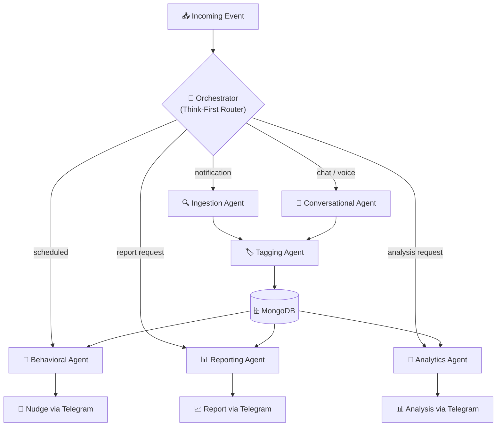
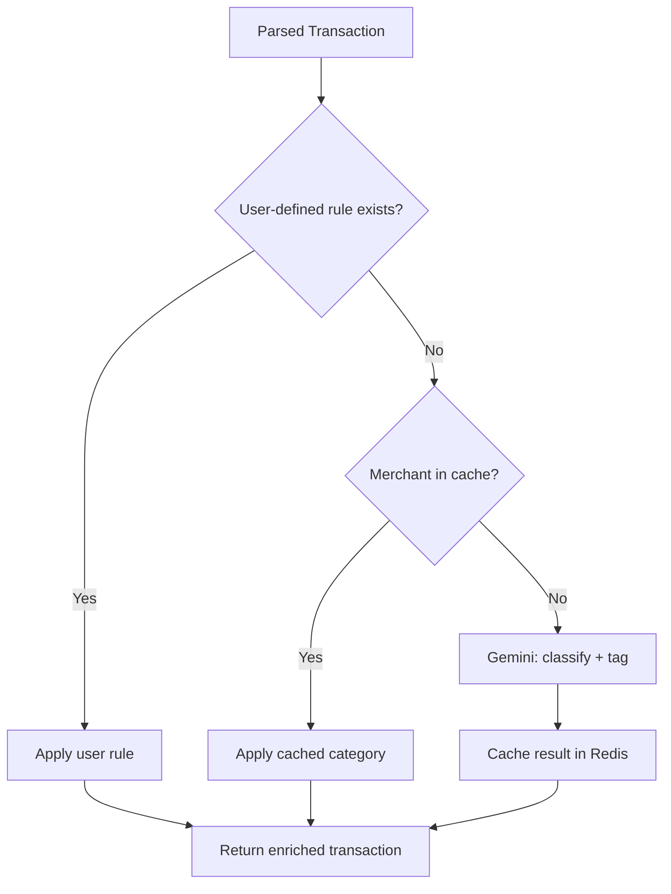

# ChiWi — Multi-Agent System

## Overview

ChiWi operates as a **swarm of 6 specialized AI agents**, each with a distinct system prompt, toolset, and responsibility. The agents are orchestrated by a central **Orchestrator** that follows a **"Think-First"** routing pattern.

## Orchestration Model



### Think-First Routing

The Orchestrator classifies each incoming event before dispatching:

| Event Type | Route | Agent Pipeline |
|---|---|---|
| Bank notification webhook | `notification` | Ingestion → Tagging → Store |
| Telegram text message | `chat` | Conversational → Tagging → Store |
| Telegram voice message | `voice` | Conversational (STT) → Tagging → Store |
| Scheduled cron trigger | `scheduled` | Behavioral → Nudge |
| User report request | `report` | Reporting → Dashboard |
| User analysis request | `analysis` | Analytics → Telegram |
| Edit callback button | `correction` | Direct DB update + learn |

---

## Agent Specifications

### 1. Ingestion Agent (The Collector)

| Property | Value |
|---|---|
| **File** | `src/agents/ingestion.py` |
| **LLM** | Gemini 2.5 Flash |
| **Trigger** | Webhook from MacroDroid/Tasker/iOS Shortcuts |
| **Input** | Raw bank notification text (PII-masked) |
| **Output** | Structured `ParsedTransaction` schema |

**Responsibilities**:
- Filter noise (non-financial notifications)
- Extract: amount, currency, direction (inflow/outflow), merchant name, timestamp
- Handle diverse Vietnamese bank formats (VCB, TCB, MBBank, ACB, etc.)
- Detect duplicate notifications

**System Prompt Outline**:
```
You are a Vietnamese bank notification parser. Given a raw notification text,
extract structured financial data. Output JSON only.
Fields: amount, currency, direction, merchant_name, transaction_time, bank_name.
If the text is NOT a financial transaction, return {"is_transaction": false}.
```

**Output Schema** (Pydantic):
```python
class ParsedTransaction(BaseModel):
    is_transaction: bool
    amount: float | None
    currency: str = "VND"
    direction: Literal["inflow", "outflow"] | None
    merchant_name: str | None
    transaction_time: datetime | None
    bank_name: str | None
    raw_text: str
    confidence: Literal["high", "medium", "low"]
```

**Performance Target**: 90%+ accuracy on amount/merchant extraction.

---

### 2. Conversational Agent (The Interface)

| Property | Value |
|---|---|
| **File** | `src/agents/conversational.py` |
| **LLM** | Gemini 2.5 Pro |
| **Trigger** | Telegram text or voice message |
| **Input** | Natural language message + conversation history |
| **Output** | Structured transaction OR conversational response |

**Responsibilities**:
- Maintain ChiWi's persona (friendly, Vietnamese, finance-savvy)
- Resolve temporal references ("hôm qua", "thứ 6 tuần trước")
- Parse informal Vietnamese amounts ("50k", "2 củ", "trăm rưỡi")
- Detect user intent: log transaction, ask question, request report
- Handle multi-turn conversations via Redis session

**System Prompt Outline**:
```
You are ChiWi, a friendly Vietnamese personal finance assistant.
Parse spending messages into structured data. Resolve relative dates
using current_date. Handle Vietnamese slang for money.
If the user is asking a question (not logging a transaction), respond conversationally.
```

**Intent Classification**:

| Intent | Example | Action |
|---|---|---|
| `log_transaction` | "Ăn phở 60k hôm qua" | Parse → Tagging → Store |
| `ask_balance` | "Tháng này chi bao nhiêu rồi?" | Query Mongo → Respond |
| `request_report` | "Báo cáo tuần này" | Route to Reporting Agent |
| `set_budget` | "Đặt ngân sách ăn uống 3 triệu" | Update budget → Confirm |
| `general_chat` | "Chào ChiWi" | Conversational response |

---

### 3. Context & Tagging Agent (The Classifier)

| Property | Value |
|---|---|
| **File** | `src/agents/tagging.py` |
| **LLM** | Gemini 2.5 Flash |
| **Trigger** | Called by Orchestrator after Ingestion/Conversational Agent |
| **Input** | Parsed transaction data + historical context |
| **Output** | Category assignment + metadata tags |

**Responsibilities**:
- Map merchants to categories using historical data + AI
- Generate deep metadata tags (time-of-day, context, lifestyle)
- Ensure tagging consistency across similar transactions
- Learn from user corrections (update `merchant_cache` in Redis)

**Tagging Strategy**:



**Tag Types**:

| Type | Examples | Purpose |
|---|---|---|
| `category` | food, transport, entertainment | Primary classification |
| `subcategory` | cafe, gas, subscription | Granular grouping |
| `temporal` | morning, weekend, end_of_month | Time pattern analysis |
| `behavioral` | routine, impulse, social | Behavioral Agent input |
| `lifestyle` | work_related, hobby, health | Personal context |

---

### 4. Behavioral Agent (The Psychologist)

| Property | Value |
|---|---|
| **File** | `src/agents/behavioral.py` |
| **LLM** | Gemini 2.5 Pro |
| **Trigger** | Scheduled cron (daily/hourly) |
| **Input** | Aggregated transactions + user profile |
| **Output** | Nudge messages sent via Telegram |

**Responsibilities**:
- Analyze spending patterns and detect anomalies
- Compare current spending against budgets and goals
- Generate personalized nudge messages in Vietnamese
- Use user profile (occupation, hobbies) for relatable analogies
- Track nudge effectiveness (was_read, user_acted)

**Nudge Categories**:

| Type | Trigger | Example |
|---|---|---|
| `spending_alert` | Unusual spending spike | "☕ 500k cafe tuần này — bằng nửa cuộn Kodak Portra!" |
| `budget_exceeded` | Budget threshold crossed | "⚠️ Đã dùng 80% ngân sách Ăn uống" |
| `goal_progress` | Goal milestone | "🎯 Quỹ mua lens đạt 50%! Còn 7.5M nữa" |
| `saving_streak` | Positive behavior | "🎉 3 ngày chi dưới trung bình. Giỏi lắm!" |
| `subscription_reminder` | Recurring charge detected | "🔄 Netflix sẽ trừ 260k ngày mai" |

**Anti-Spam Rules**:
- Max 2 nudges per day
- No duplicate nudge types within 24 hours
- Respect user's `nudge_frequency` preference

---

### 5. Reporting Agent (The Strategist)

| Property | Value |
|---|---|
| **File** | `src/agents/reporting.py` |
| **LLM** | Gemini 2.5 Pro |
| **Trigger** | Scheduled cron (weekly) or user request |
| **Input** | Transaction aggregates from MongoDB |
| **Output** | Formatted report + Mini App data |

**Responsibilities**:
- Generate periodic financial summaries (daily/weekly/monthly)
- Produce narrative insights, not just numbers
- Identify spending trends and forecast future patterns
- Cache reports in MongoDB for Mini App dashboard access

**Report Types**:

| Type | Schedule | Content |
|---|---|---|
| `daily_summary` | End of day | Quick spend total + top categories |
| `weekly_summary` | Every Monday | Category breakdown + week-over-week comparison |
| `monthly_report` | 1st of month | Full month analysis + goal progress + forecast |
| `goal_progress` | On demand | Per-goal tracking with projected completion date |

---

## Agent Communication Protocol

Agents communicate via the Orchestrator using a shared **AgentMessage** schema:

```python
class AgentMessage(BaseModel):
    agent_id: str           # Source agent identifier
    event_type: str         # Message classification
    payload: dict           # Structured data
    metadata: dict          # Processing info (model, latency, confidence)
    timestamp: datetime
    chat_id: str            # Required for all messages
```

All inter-agent data passes through the Orchestrator — agents never call each other directly.

## Error Handling

| Scenario | Behavior |
|---|---|
| LLM API timeout | Retry 2x with exponential backoff, then log and notify user |
| Low confidence parse | Send to user with "⚠️ Không chắc lắm, kiểm tra giúp?" + Edit button |
| Duplicate transaction | Detect via amount + time window (5 min), ask user to confirm |
| Unknown message format | Log raw text, respond "Không hiểu, bạn thử lại nhé?" |

---

### 6. Analytics Agent (The Analyst)

| Property | Value |
|---|---|
| **File** | `src/agents/analytics.py` |
| **LLM** | Gemini 2.5 Pro |
| **Trigger** | User request via chat (e.g., "so sánh tuần này với tuần trước") |
| **Input** | Transaction data from two periods + analysis parameters |
| **Output** | Formatted comparative/trend analysis |

**Responsibilities**:
- Period-over-period comparison (week vs week, month vs month)
- Spending trend detection across time
- Category and merchant-level deep-dives
- Anomaly identification and actionable insights

**Analysis Types**:

| Type | Trigger Example | Description |
|---|---|---|
| `compare` | "so sánh tuần này với tuần trước" | Side-by-side period comparison |
| `trend` | "xu hướng chi tiêu tháng này" | Spending direction over time |
| `deep_dive` | "phân tích chi tiêu ăn uống" | Category/merchant drill-down *(planned)* |

See [FEATURE_ANALYTICS.md](./FEATURE_ANALYTICS.md) for full specification.
