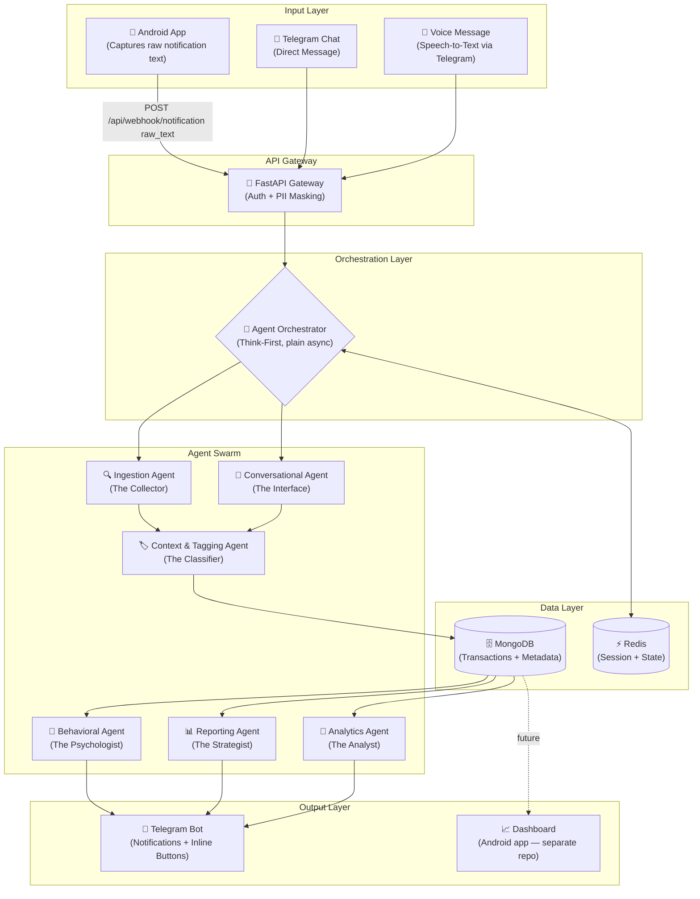
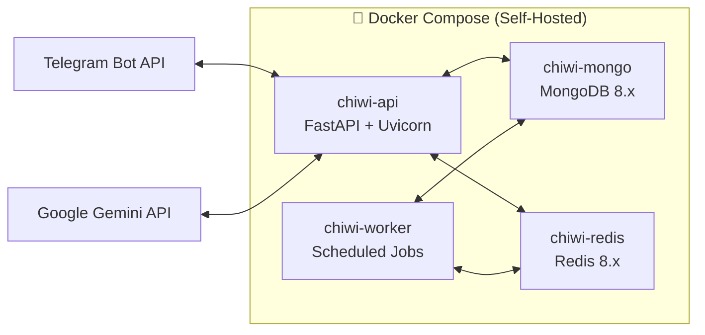

# ChiWi — System Architecture

## Overview

ChiWi is a **zero-effort, proactive personal finance management system** powered by a Multi-Agent AI Swarm. It automatically captures financial transactions from bank notifications, classifies them using AI, and proactively nudges the user toward healthier spending habits.

The system follows a **"Think-First"** strategy: an orchestrator identifies the correct specialized agent before any execution occurs.

## Design Principles

| Principle | Description |
|---|---|
| **Zero-Effort** | Financial tracking should never feel like a second job. Use ambient data (notifications) and natural language (chat). |
| **Proactive** | The system observes patterns and nudges the user — it doesn't wait for a query. |
| **Privacy-First** | All PII is masked before reaching any LLM. Self-hosted on user's infrastructure. |
| **Agent Specialization** | Each AI agent has a single responsibility with its own system prompt, toolset, and evaluation criteria. |
| **Async-Native** | All I/O, database, and LLM calls are fully asynchronous. |

## High-Level Architecture



## Component Responsibilities

### 1. Input Layer
Two active input channels:
- **Telegram chat / voice** — direct messages and voice notes processed by the Conversational Agent.
- **Android app** (separate repository) — captures raw bank notification text natively (NotificationListenerService) and forwards it verbatim to `POST /api/webhook/notification`. All AI parsing (Ingestion Agent, Gemini Flash) happens server-side so parsing improvements never require a mobile release. The Android app is responsible only for: notification capture, auth header injection, local offline queue (retry when backend unreachable), and future visualization.

### 2. API Gateway (FastAPI)
- **Authentication**: Validates Telegram `user_id` / `chat_id` against an allow-list.
- **PII Masking**: Strips account numbers, phone numbers, and sensitive identifiers before forwarding to any LLM agent.
- **Rate Limiting**: Protects against abuse and controls API cost.
- **Routing**: Dispatches incoming events to the Agent Orchestrator.

### 3. Agent Orchestrator
The central brain that implements a **"Think-First"** routing pattern using plain async dispatch (not LangGraph):
1. Classifies the incoming event type (notification, chat message, voice, scheduled trigger).
2. Selects the appropriate agent pipeline.
3. Manages multi-agent collaboration and data handoff.
4. Loads the user's profile timezone for correct day-boundary calculations.

### 4. Agent Swarm
Six specialized agents, each with a distinct system prompt and toolset. See [AGENTS.md](./AGENTS.md) for full documentation.

### 5. Data Layer
- **MongoDB**: Primary persistent storage for transactions, user profiles, category mappings, and agent-generated metadata.
- **Redis**: Ephemeral state management — conversation history, session context, agent intermediate results, and rate-limit counters.

### 6. Output Layer
- **Telegram Bot**: Primary user interface for confirmations, nudges, and quick interactions via inline buttons.
- **Android App** (separate repository, in development): Two roles —
  1. **Notification capture** (active): `NotificationListenerService` forwards raw bank notification text to `POST /api/webhook/notification`. All AI parsing stays on the backend.
  2. **Visual dashboard** (planned): Charts, drill-downs, and transaction history views. This repo exposes the data via the existing MongoDB/REST layer; the Android app consumes it.

## Deployment Architecture



All services are containerized and orchestrated via `docker-compose.yaml`. The system is designed to run entirely on a single self-hosted machine (e.g., home server, VPS).

## Directory Structure

```
chiwi/
├── src/
│   ├── agents/           # Individual agent logic
│   │   ├── ingestion.py
│   │   ├── conversational.py
│   │   ├── tagging.py
│   │   ├── behavioral.py
│   │   ├── reporting.py
│   │   ├── analytics.py
│   │   └── prompts/      # System prompt .md files (one per agent)
│   ├── api/              # FastAPI endpoints
│   │   ├── routes/
│   │   │   ├── webhook.py  # Bank notification + Telegram bot commands
│   │   │   └── health.py
│   │   └── middleware/
│   │       └── pii_mask.py
│   ├── core/             # Orchestrator and shared utilities
│   │   ├── orchestrator.py
│   │   ├── config.py
│   │   ├── schemas.py
│   │   ├── profiles.py     # User profile loader (config/user_profiles.json)
│   │   ├── categories.py   # Category loader (config/categories.json)
│   │   ├── toon.py         # Token-optimised context encoder for LLM payloads
│   │   ├── utils.py        # Timezone-aware date-range helpers
│   │   ├── spending_avg.py # Per-category baseline averages (ask_spending_vs_avg + spike detection)
│   │   └── dependencies.py
│   ├── db/               # Database models and repositories
│   │   ├── models/
│   │   │   ├── transaction.py, budget.py, goal.py, nudge.py
│   │   │   ├── subscription.py   # Recurring charge tracking
│   │   │   ├── correction.py, report.py, category.py, user.py
│   │   └── repositories/
│   │       ├── transaction_repo.py, budget_repo.py, goal_repo.py
│   │       ├── nudge_repo.py, correction_repo.py, user_repo.py
│   │       └── subscription_repo.py  # insert, find_by_merchant, find_upcoming, mark_charged
│   ├── services/         # External service integrations
│   │   ├── telegram.py
│   │   ├── gemini.py
│   │   └── redis_client.py
│   ├── main.py           # FastAPI entrypoint
│   └── worker.py         # Scheduled cron worker (behavioral nudges, budget/spending/goal trigger detection)
├── config/
│   ├── categories.json   # Spending categories (edit to add/rename)
│   └── user_profiles.json # Per-user personalisation profiles (edit to configure)
├── tests/
├── docs/
├── docker-compose.yaml
├── Dockerfile
├── Makefile
├── .env.example
├── requirements.txt
└── CLAUDE.md
```

## Security Model

| Layer | Mechanism |
|---|---|
| **Transport** | HTTPS for all external communication (Telegram webhook, Gemini API) |
| **Authentication** | Telegram `user_id` allow-list at Gateway level |
| **PII Protection** | Account numbers and phone numbers stripped before LLM calls |
| **Data at Rest** | MongoDB encryption enabled |
| **Secrets** | All credentials via environment variables (`.env`), never hardcoded |
| **AI Privacy** | Gemini API configured to not use data for model training |
