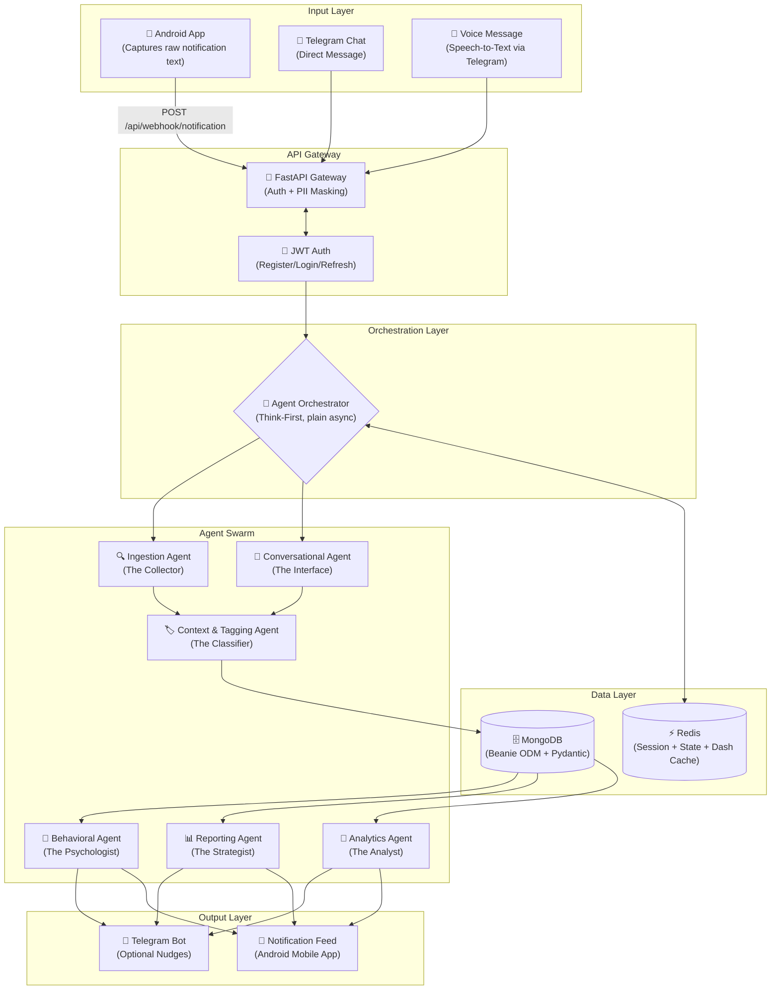
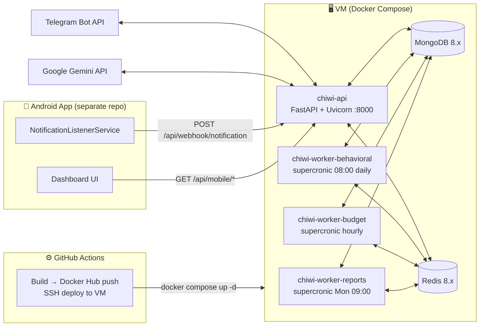

# ChiWi — System Architecture

## Overview

ChiWi is a **zero-effort, proactive personal finance management system** powered by a Multi-Agent AI Swarm. It automatically captures financial transactions from bank notifications, classifies them using AI, provides a daily 8:00 AM spending analysis, and proactively nudges the user toward healthier spending habits.

The system follows a **"Think-First"** strategy: an orchestrator identifies the correct specialized agent before any execution occurs.

## Design Principles

| Principle | Description |
|---|---|
| **Zero-Effort** | Financial tracking should never feel like a second job. Use ambient data (notifications) and natural language (chat). |
| **Proactive** | The system observes patterns and nudges the user — it doesn't wait for a query. |
| **Privacy-First** | All PII is masked before reaching any LLM. Self-hosted on user's infrastructure. |
| **Agent Specialization** | Each AI agent has a single responsibility with its own system prompt, toolset, and evaluation criteria. |
| **Async-Native** | All I/O, database, and LLM calls are fully asynchronous. |

## High-Level Architecture



## Component Responsibilities

### 1. Input Layer
Three input channels:
- **Android app** (Primary): Captures bank notifications and provides the primary UI. Fully functional via REST API.
- **Telegram chat / voice** (Optional): Direct messages and voice notes. Logic is decoupled so the system works even if Telegram is disabled.
- **API Clients**: Standard REST clients using the `/api/mobile/*` endpoints.

### 2. API Gateway (FastAPI)
- **Authentication**: All access is gated on `UserDocument.is_active`.
    - **Mobile REST** (`/api/mobile/*`, `/api/auth/*`): JWT Bearer token containing the internal UUID (`user_id`).
    - **Telegram webhook**: `telegram_id` resolved to a `UserDocument` via DB lookup.
    - **Android notification webhook**: `X-User-Id` header resolved via DB lookup.
- **Identity Model**: Each user has one stable internal UUID. Multiple auth methods (Username/Password, Telegram, SSO) link back to this single UUID.
- **Phase D (Complete)**: Data Portability & Privacy. Implements manual export (CSV/JSON), manual report/analysis triggers, and full account deletion (`DELETE /api/mobile/user`).
- **PII Masking**: Strips sensitive identifiers before forwarding to AI agents.
- **Routing**: Dispatches incoming events to the Agent Orchestrator.
- **Optionality**: Backend is fully functional even if Telegram is disabled (`TELEGRAM_BOT_TOKEN` not provided).

### 3. Agent Orchestrator
The central brain that handles routing:
1. Classifies the incoming event source (Android, Telegram, Scheduled).
2. Selects the appropriate agent pipeline.
3. Manages collaborator handoff.
4. Handles delivery channels (skips Telegram send if disabled, always ensures persistence for mobile feed).

### 4. Agent Swarm
Six specialized agents. Each interaction is wrapped in a **Personalization Engine** (`src/core/profiles.py`) that dynamically injects the user's chosen `display_name`, `assistant_personality` (Strict/Encouraging/Objective), and `communication_tone` into the system prompt. See [AGENTS.md](./AGENTS.md) for full documentation.

### 5. Data Layer
- **MongoDB**: Primary persistent storage for transactions, user identities, personalization profiles, category mappings, and agent-generated metadata. Managed via **Beanie ODM** for type-safe document modeling and validation.
- **Redis**: Ephemeral state management — conversation history, session context, merchant→category cache (7-day TTL), rate-limit counters, and the pre-computed mobile dashboard cache (`chiwi:dashboard:{user_id}`, 5-min TTL, invalidated on every transaction write/correction).

### 6. Output Layer
- **Telegram Bot** (Optional): confirming, nudging, and quick interactions via inline buttons if a token is provided.
- **Android App**: Consumes the `/api/mobile/*` REST endpoints. Unified notification feed and pre-computed dashboard.
- Endpoints: `/api/mobile/dashboard`, `/transactions`, `/budgets`, `/goals`, `/subscriptions`, `/nudges`, `/profile`.
- `/api/mobile/subscriptions` returns `last_charged_at` alongside `next_charge_date` and `due_in_days`, enabling the Android app to derive upcoming-payment and recently-paid views client-side.

## Deployment Architecture



All four app containers share the same Docker image pinned to a commit SHA on each deploy. MongoDB and Redis are not exposed externally (bound to `127.0.0.1` only).

## Directory Structure

```
chiwi/
├── src/
│   ├── agents/           # Individual agent logic
│   │   ├── ingestion.py
│   │   ├── conversational.py
│   │   ├── tagging.py
│   │   ├── behavioral.py
│   │   ├── reporting.py
│   │   ├── analytics.py
│   │   └── prompts/      # System prompt .md files (one per agent)
│   ├── api/              # FastAPI endpoints
│   │   ├── routes/
│   │   │   ├── webhook.py  # Bank notification + Telegram bot commands
│   │   │   ├── mobile.py   # /api/mobile/* REST endpoints for Android dashboard
│   │   │   └── health.py
│   │   └── middleware/
│   │       └── pii_mask.py
│   ├── core/             # Orchestrator and shared utilities
│   │   ├── orchestrator.py
│   │   ├── config.py
│   │   ├── schemas.py
│   │   ├── profiles.py     # Personalization engine (Persona Injection)
│   │   ├── categories.py   # Category loader (config/categories.json)
│   │   ├── toon.py         # Token-optimised context encoder for LLM payloads
│   │   ├── utils.py        # Timezone-aware date-range helpers
│   │   ├── spending_avg.py # Per-category baseline averages (ask_spending_vs_avg + spike detection)
│   │   └── dependencies.py
│   ├── db/               # Database models and repositories
│   │   ├── models/       # Beanie Document models (Pydantic-based)
│   │   │   ├── transaction.py, budget.py, goal.py, nudge.py
│   │   │   ├── subscription.py   # Recurring charge tracking
│   │   │   ├── correction.py, report.py, category.py, user.py
│   │   └── repositories/ # ODM-based data access layer
│   │       ├── transaction_repo.py, budget_repo.py, goal_repo.py
│   │       ├── nudge_repo.py, correction_repo.py, user_repo.py
│   │       └── subscription_repo.py
│   ├── services/         # External service integrations
│   │   ├── telegram.py
│   │   ├── gemini.py
│   │   ├── redis_client.py
│   │   └── dashboard.py  # DashboardService: Redis-cached aggregation for /api/mobile/dashboard
│   ├── main.py           # FastAPI entrypoint (Beanie initialization)
│   └── worker.py         # Scheduled cron worker
├── │   └── categories.json   # Spending categories (edit to add/rename)
├── tests/
├── docs/
├── cron/
│   ├── worker-behavioral.cron   # 0 8 * * *  (daily 08:00 ICT)
│   ├── worker-budget.cron       # 0 * * * *  (hourly)
│   └── worker-reports.cron      # 0 9 * * 1  (Monday 09:00 ICT)
├── docker-compose.yaml
├── Dockerfile
├── Makefile
├── .env.example
├── requirements.txt
└── CLAUDE.md
```

## Security Model

| Layer | Mechanism |
|---|---|
| **Transport** | HTTPS for all external communication (Telegram webhook, Gemini API) |
| **Authentication** | `UserDocument.is_active` DB check for all entry points (Telegram, Android webhook, JWT for mobile REST) |
| **PII Protection** | Account numbers and phone numbers stripped before LLM calls |
| **Data at Rest** | MongoDB encryption enabled |
| **Secrets** | All credentials via environment variables (`.env`), never hardcoded |
| **AI Privacy** | Gemini API configured to not use data for model training |
