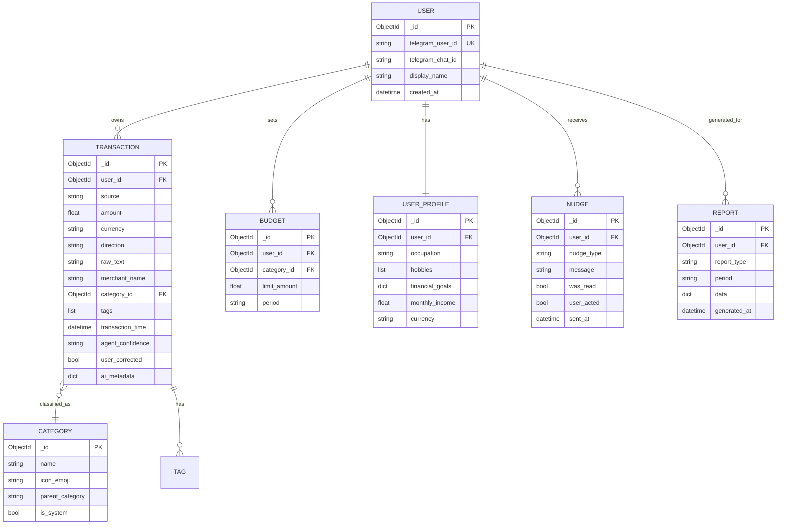

# ChiWi — Database Design

## Overview

ChiWi uses **MongoDB** as primary data store and **Redis** for ephemeral state. MongoDB's schema-less nature handles unpredictable AI-generated metadata (dynamic tags, sentiment scores, behavioral flags).

## Entity Relationship Diagram

## Collections Detail

### `users`

Primary user record linked to Telegram identity.

| Field | Type | Description |
|---|---|---|
| `_id` | ObjectId | Primary key |
| `telegram_user_id` | string | **Unique**. Telegram user ID for auth |
| `telegram_chat_id` | string | Telegram chat ID for messaging |
| `display_name` | string | User display name |
| `created_at` | datetime | Account creation timestamp |
| `updated_at` | datetime | Last update timestamp |

**Indexes**: `telegram_user_id` (unique)

---

### `user_profiles` (config-driven)

> **Stored in `config/user_profiles.json`**, not MongoDB. Edit the file to change personalisation without redeploying. Keyed by `telegram_user_id`. A `"default"` key provides fallback for unconfigured users. Keys starting with `_` are treated as comments and ignored by the loader.

| Field | Type | Description |
|---|---|---|
| `chat_id` | string | Telegram chat ID for delivering nudges |
| `timezone` | string | IANA timezone (e.g. `"Asia/Ho_Chi_Minh"`). Drives day-boundary math and LLM date formatting. Storage is always UTC. |
| `occupation` | string | e.g., `"Senior DevOps Engineer"` |
| `hobbies` | list | e.g., `["film_photography", "coffee"]` |
| `interests` | list | For analogy generation, e.g., `["Kodak Portra 400"]` |
| `communication_tone` | string | `friendly` / `playful` / `formal` / `concise` |
| `nudge_frequency` | string | `daily` / `weekly` / `off` |
| `language` | string | Default `"vi"` |
| `extras` | dict | Free-form personalisation hints |

---

### `transactions`

Core financial data. Immutable after creation.

| Field | Type | Description |
|---|---|---|
| `user_id` | ObjectId | FK → `users` |
| `source` | string | `notification` / `chat` / `voice` / `manual` |
| `amount` | float | Transaction amount |
| `currency` | string | e.g., "VND" |
| `direction` | string | `inflow` / `outflow` |
| `raw_text` | string | Original unprocessed text |
| `merchant_name` | string | AI-extracted merchant |
| `category_id` | ObjectId | FK → `categories` |
| `tags` | list | AI-generated tags: `["cafe", "morning"]` |
| `transaction_time` | datetime | When the transaction occurred |
| `created_at` | datetime | When the record was created |
| `agent_confidence` | string | `high` / `medium` / `low` |
| `user_corrected` | bool | Whether user corrected AI classification |
| `ai_metadata` | dict | Agent processing details |

**Indexes**:
- `user_id` + `transaction_time` (compound, primary query pattern)
- `user_id` + `category_id` (compound, aggregation)
- `merchant_name` (text index)

---

### `categories`

System-defined and user-customizable spending categories.

| Emoji | Name | Parent |
|---|---|---|
| 🍔 | Food & Beverage | — |
| ☕ | Cafe | Food & Beverage |
| 🚗 | Transportation | — |
| 🛒 | Shopping | — |
| 🏠 | Housing | — |
| 💡 | Utilities | Housing |
| 🎬 | Entertainment | — |
| 📸 | Hobbies | — |
| 💊 | Health | — |
| 📚 | Education | — |
| 💰 | Income | — |
| 🔄 | Transfer | — |
| ❓ | Uncategorized | — |

---

### `budgets`

Spending limits per category per time period. Every mutation also writes an immutable record to `budget_events`.

| Field | Type | Description |
|---|---|---|
| `user_id` | string | Telegram user ID |
| `category_id` | string | Stable category slug |
| `limit_amount` | float | Base recurring limit |
| `period` | string | `daily` / `weekly` / `monthly` |
| `is_active` | bool | `false` = soft-deleted |
| `created_at` | datetime | UTC |
| `updated_at` | datetime\|null | Set when `limit_amount` changes |
| `is_silenced` | bool | `true` = tracked but no alert nudges sent |
| `silenced_at` | datetime\|null | When silencing was activated |
| `temp_limit` | float\|null | Single-cycle limit override |
| `temp_limit_expires_at` | datetime\|null | UTC expiry of the temp override |
| `temp_limit_reason` | string\|null | User-provided reason for override |

---

### `budget_events`

Immutable audit log of every user action on a budget. Never updated — only inserted. Used by Behavioral and Analytics agents to detect patterns (repeated silencing, frequent overrides, limit creep after payday).

| Field | Type | Description |
|---|---|---|
| `user_id` | string | Telegram user ID |
| `budget_id` | string | FK → `budgets._id` |
| `category_id` | string | Stable category slug |
| `event_type` | string | `created`, `limit_updated`, `temp_override_set`, `silenced`, `unsilenced`, `disabled`, `reactivated` |
| `old_value` | dict | Snapshot of changed fields before mutation |
| `new_value` | dict | Snapshot of changed fields after mutation |
| `reason` | string\|null | User-provided context |
| `triggered_by` | string | `user` / `system` |
| `created_at` | datetime | UTC |

---

### `subscriptions`

Registered recurring charges for reminder and auto-match tracking.

| Field | Type | Description |
|---|---|---|
| `user_id` | string | Telegram user ID |
| `name` | string | Display name, e.g. "Netflix" |
| `merchant_name` | string | Normalised merchant for transaction matching (case-insensitive regex) |
| `amount` | float | Expected charge amount |
| `currency` | string | e.g. "VND" |
| `period` | string | `weekly` / `monthly` / `yearly` |
| `next_charge_date` | datetime | Next expected charge date (UTC). Automatically advanced by one period on each charge. |
| `last_charged_at` | datetime | When the last charge was recorded (UTC) |
| `is_active` | bool | `false` = soft-deleted |
| `source` | string | `manual` (user-registered via chat) or `auto_detected` (future: detected from pattern) |
| `cancellation_reason` | string\|null | `"manual"` (user cancelled) or `"replaced"` (superseded by an update) |
| `replaces_id` | string\|null | `_id` of the subscription this record supersedes (set by `update_subscription`) |
| `created_at` | datetime | Record creation timestamp (UTC) |

**Indexes**: `user_id` + `is_active`, `user_id` + `merchant_name` + `is_active` (matching), `user_id` + `next_charge_date` (reminder queries)

**Lifecycle**:
- Created via `set_subscription` chat intent or future auto-detection.
- `next_charge_date` advances by one period when: (a) an incoming transaction matches the merchant, or (b) user says "Netflix đã trả rồi" (`mark_subscription_paid`).
- **Update pattern** (`update_subscription`): the existing record is deactivated with `cancellation_reason="replaced"`, and a new record is inserted with `replaces_id` pointing to the old `_id`. This preserves full subscription history.
- Worker queries `find_upcoming(within_hours=48)` to fire `subscription_reminder` nudges.

---

### `nudges`

Record of every proactive message sent by the Behavioral Agent. Also drives anti-spam checks (daily count, 24 h dedup by type).

| Field | Type | Description |
|---|---|---|
| `user_id` | string | Telegram user ID |
| `nudge_type` | string | `spending_alert`, `budget_warning`, `budget_exceeded`, `goal_progress`, `saving_streak`, `subscription_reminder`, `impulse_detection` |
| `message` | string | The nudge text sent to user |
| `trigger_reason` | string | Why this nudge was triggered |
| `was_read` | bool | Whether user saw it |
| `user_acted` | bool | Whether user changed behavior |
| `sent_at` | datetime | When sent (UTC) |

**Indexes**: `user_id` + `sent_at`, `user_id` + `nudge_type` + `sent_at` (anti-spam queries)

---

### `corrections`

Audit trail for user category corrections; also powers Tagging Agent learning.

| Field | Type | Description |
|---|---|---|
| `user_id` | string | Telegram user ID |
| `transaction_id` | string | FK → `transactions._id` |
| `merchant_name` | string | Merchant affected |
| `old_category` | string | Category before correction |
| `new_category` | string | Category after correction |
| `corrected_at` | datetime | When the correction was made (UTC) |

---

### `reports`

Generated financial reports cached for re-access.

| Field | Type | Description |
|---|---|---|
| `user_id` | ObjectId | FK → `users` |
| `report_type` | string | `daily_summary`, `weekly_summary`, `monthly_report`, `goal_progress` |
| `period` | string | e.g., "2026-W16", "2026-04" |
| `data` | dict | Full report payload |
| `generated_at` | datetime | Generation timestamp |

---

## Redis Key Schema

All keys prefixed with `chiwi:`.

| Key Pattern | Type | TTL | Purpose |
|---|---|---|---|
| `chiwi:session:{chat_id}` | Hash | 30 min | Conversation state & context |
| `chiwi:rate_limit:{chat_id}` | Counter | 1 min | Per-user API rate limiting |
| `chiwi:telegram:update:{update_id}` | String | 5 min | Dedup Telegram webhook updates |
| `chiwi:merchant_cache:{merchant}` | String | 7 days | Merchant → category hot cache (invalidated on correction) |

## Migration Strategy

Migrations handled at the application level via versioned scripts in `scripts/migrations/`. Each migration is idempotent and tracked in a `_migrations` collection.
