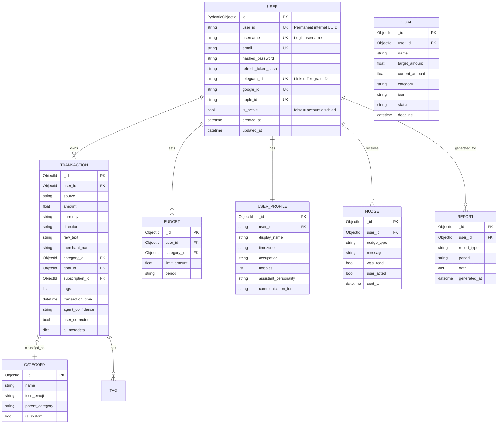

# ChiWi — Database Design

## Overview

ChiWi uses **MongoDB** as primary data store, managed via **Beanie ODM** (Object Document Mapper) for type safety and Pydantic validation. **Redis** is used for ephemeral state and caching.

## Entity Relationship Diagram

## Collections Detail

### `users`

Primary user record.

| Field | Type | Description |
|---|---|---|
| `id` | PydanticObjectId | Primary key (MongoDB `_id`) |
| `user_id` | string | **Unique**. Permanent internal UUID (stable reference) |
| `username` | string | **Unique**. Local login name |
| `email` | string | **Unique**. User email for SSO/Recovery |
| `hashed_password` | string | Bcrypt hash for local login |
| `refresh_token_hash` | string | Hash of current refresh token |
| `telegram_id` | string | Linked Telegram ID (set via `/link` flow) |
| `google_id` | string | Linked Google SSO ID |
| `apple_id` | string | Linked Apple SSO ID |
| `is_active` | bool | **Account status. `false` = disabled.** |
| `created_at` | datetime | Account creation timestamp (UTC) |
| `updated_at` | datetime | Last update timestamp (UTC) |

**Indexes**: `user_id` (unique)

---

### `user_profiles`

Personalization preferences — editable via the Android Settings screen (`PUT /api/mobile/profile`).

| Field | Type | Description |
|---|---|---|
| `user_id` | string | FK → `users.user_id` (UUID) |
| `display_name` | string | Personal name Mai uses to greet the user |
| `timezone` | string | IANA timezone (default: `"Asia/Ho_Chi_Minh"`) |
| `occupation` | string | e.g., `"Senior DevOps Engineer"` |
| `hobbies` | list | e.g., `["film_photography", "coffee"]` |
| `interests` | list | General interest context for AI analogies |
| `communication_tone` | string | `friendly` / `playful` / `formal` / `concise` |
| `assistant_personality` | string | `encouraging` / `objective` / `strict` |
| `nudge_frequency` | string | `daily` / `weekly` / `off` |
| `language` | string | Default `"vi"` |
| `extras` | dict | Free-form personalisation hints |
| `updated_at` | datetime | Last profile update (UTC) |

---

### `transactions`

Core financial data. Immutable after creation.

| Field | Type | Description |
|---|---|---|
| `user_id` | ObjectId | FK → `users` |
| `source` | string | `notification` / `chat` / `voice` / `manual` |
| `amount` | float | Transaction amount |
| `currency` | string | e.g., "VND" |
| `direction` | string | `inflow` / `outflow` / `savingflow` |
| `raw_text` | string | Original unprocessed text |
| `merchant_name` | string | AI-extracted merchant |
| `category_id` | ObjectId | FK → `categories` |
| `tags` | list | AI-generated tags: `["cafe", "morning"]` |
| `transaction_time` | datetime | When the transaction occurred |
| `created_at` | datetime | When the record was created |
| `agent_confidence` | string | `high` / `medium` / `low` |
| `user_corrected` | bool | Whether user corrected AI classification |
| `goal_id` | ObjectId | FK → `goals` |
| `subscription_id` | ObjectId | FK → `subscriptions` |
| `ai_metadata` | dict | Agent processing details |

**Indexes**:
- `user_id` + `transaction_time` (compound, primary query pattern)
- `user_id` + `category_id` (compound, aggregation)
- `user_id` + `goal_id` (compound, filtering)
- `user_id` + `subscription_id` (compound, history tracking)
- `merchant_name` (text index)

---

### `categories`

System-defined and user-customizable spending categories.

| Emoji | Name | Parent |
|---|---|---|
| 🍔 | Food & Beverage | — |
| ☕ | Cafe | Food & Beverage |
| 🚗 | Transportation | — |
| 🛒 | Shopping | — |
| 🏠 | Housing | — |
| 💡 | Utilities | Housing |
| 🎬 | Entertainment | — |
| 📸 | Hobbies | — |
| 💊 | Health | — |
| 📚 | Education | — |
| 💰 | Income | — |
| 🔄 | Transfer | — |
| ❓ | Uncategorized | — |

---

### `budgets`

Spending limits per category per time period. Every mutation also writes an immutable record to `budget_events`.

| Field | Type | Description |
|---|---|---|
| `user_id` | string | Telegram user ID |
| `category_id` | string | Stable category slug |
| `limit_amount` | float | Base recurring limit |
| `period` | string | `daily` / `weekly` / `monthly` |
| `is_active` | bool | `false` = soft-deleted |
| `created_at` | datetime | UTC |
| `updated_at` | datetime\|null | Set when `limit_amount` changes |
| `is_silenced` | bool | `true` = tracked but no alert nudges sent |
| `silenced_at` | datetime\|null | When silencing was activated |
| `temp_limit` | float\|null | Single-cycle limit override |
| `temp_limit_expires_at` | datetime\|null | UTC expiry of the temp override |
| `temp_limit_reason` | string\|null | User-provided reason for override |

---

### `budget_events`

Immutable audit log of every user action on a budget. Never updated — only inserted. Used by Behavioral and Analytics agents to detect patterns (repeated silencing, frequent overrides, limit creep after payday).

| Field | Type | Description |
|---|---|---|
| `user_id` | string | Telegram user ID |
| `budget_id` | string | FK → `budgets._id` |
| `category_id` | string | Stable category slug |
| `event_type` | string | `created`, `limit_updated`, `temp_override_set`, `silenced`, `unsilenced`, `disabled`, `reactivated` |
| `old_value` | dict | Snapshot of changed fields before mutation |
| `new_value` | dict | Snapshot of changed fields after mutation |
| `reason` | string\|null | User-provided context |
| `triggered_by` | string | `user` / `system` |
| `created_at` | datetime | UTC |

---

### `subscriptions`

Registered recurring charges for reminder and auto-match tracking.

| Field | Type | Description |
|---|---|---|
| `user_id` | string | Telegram user ID |
| `name` | string | Display name, e.g. "Netflix" |
| `merchant_name` | string | Normalised merchant for transaction matching (case-insensitive regex) |
| `amount` | float | Expected charge amount |
| `currency` | string | e.g. "VND" |
| `period` | string | `weekly` / `monthly` / `yearly` |
| `next_charge_date` | datetime | Next expected charge date (UTC, midnight VN = 17:00 UTC). Advanced by `_advance_date` in `subscription_repo.py`. |
| `anchor_day` | int\|null | Preferred day-of-month for the charge (e.g. `31` = end of month). `_advance_date` snaps the next month's date to `min(anchor_day, last_day_of_month)` in `Asia/Ho_Chi_Minh` time. `null` falls back to the day component of `next_charge_date`. |
| `last_charged_at` | datetime\|null | When the last charge was recorded (UTC). Used by `query_subscription` to compute the paid-this-period flag. |
| `is_active` | bool | `false` = soft-deleted |
| `source` | string | `manual` (user-registered via chat) or `auto_detected` (future: detected from pattern) |
| `cancellation_reason` | string\|null | `"manual"` (user cancelled) or `"replaced"` (superseded by an update) |
| `replaces_id` | string\|null | `_id` of the subscription this record supersedes (set by `update_subscription`) |
| `created_at` | datetime | Record creation timestamp (UTC) |

**Indexes**: `user_id` + `is_active`, `user_id` + `merchant_name` + `is_active` (matching), `user_id` + `next_charge_date` (reminder queries)

**Lifecycle**:
- Created via `set_subscription` chat intent or future auto-detection. `anchor_day` is set from the day component of the first `next_charge_date` (in VN local time).
- `next_charge_date` is advanced by `_advance_date(current, period, anchor_day)` in `SubscriptionRepository.mark_charged` when: (a) an incoming transaction matches the merchant, or (b) user says "Netflix đã trả rồi" (`mark_subscription_paid`). Arithmetic is performed in `Asia/Ho_Chi_Minh` time so that `anchor_day=31` always lands on the last day of the next month regardless of UTC offset.
- **Update pattern** (`update_subscription`): the existing record is deactivated with `cancellation_reason="replaced"`, and a new record is inserted with `replaces_id` pointing to the old `_id`. This preserves full subscription history.
- Worker queries `find_upcoming(within_hours=48)` to fire `subscription_reminder` nudges.
- `query_subscription` intent: returns per-subscription status (last charged, next charge, paid-this-period). "Paid this period" is computed in VN local time: same calendar month for `monthly`, within 7 days for `weekly`, same year for `yearly`.

---

### `nudges`

Record of every proactive message sent by the Behavioral Agent. Also drives anti-spam checks (daily count, 24 h dedup by type).

| Field | Type | Description |
|---|---|---|
| `user_id` | string | Telegram user ID |
| `nudge_type` | string | `spending_alert`, `budget_warning`, `budget_exceeded`, `goal_progress`, `saving_streak`, `subscription_reminder`, `impulse_detection` |
| `message` | string | The nudge text sent to user |
| `trigger_reason` | string | Why this nudge was triggered |
| `was_read` | bool | Whether user saw it |
| `user_acted` | bool | Whether user changed behavior |
| `sent_at` | datetime | When sent (UTC) |

**Indexes**: `user_id` + `sent_at`, `user_id` + `nudge_type` + `sent_at` (anti-spam queries)

---

### `corrections`

Audit trail for user category corrections; also powers Tagging Agent learning.

| Field | Type | Description |
|---|---|---|
| `user_id` | string | Telegram user ID |
| `transaction_id` | string | FK → `transactions._id` |
| `merchant_name` | string | Merchant affected |
| `old_category` | string | Category before correction |
| `new_category` | string | Category after correction |
| `corrected_at` | datetime | When the correction was made (UTC) |

---

### `reports`

Generated financial reports cached for re-access.

| Field | Type | Description |
|---|---|---|
| `user_id` | ObjectId | FK → `users` |
| `report_type` | string | `daily_summary`, `weekly_summary`, `monthly_report`, `goal_progress` |
| `period` | string | e.g., "2026-W16", "2026-04" |
| `data` | dict | Full report payload |
| `generated_at` | datetime | Generation timestamp |

---

## Redis Key Schema

All keys prefixed with `chiwi:`.

| Key Pattern | Type | TTL | Purpose |
|---|---|---|---|
| `chiwi:session:{chat_id}` | Hash | 30 min | Conversation state & context |
| `chiwi:rate_limit:{chat_id}` | Counter | 1 min | Per-user API rate limiting |
| `chiwi:telegram:update:{update_id}` | String | 5 min | Dedup Telegram webhook updates |
| `chiwi:merchant:{user_id}:{merchant}` | String | 7 days | Per-user merchant → category hot cache (invalidated on correction) |
| `chiwi:dashboard:{user_id}` | String (JSON) | 5 min | Pre-computed mobile dashboard payload (invalidated on every transaction write/delete/correction) |
| `chiwi:last_txn:{user_id}` | String | session | ID of the user's most recent transaction (used by "delete last" shortcut) |

## Migration Strategy

ChiWi uses **Beanie**'s built-in migration capabilities (where applicable) and custom idempotent scripts in `scripts/`.

### Phase B Migration: Raw MongoDB → Beanie ODM
1. **Model Definition**: All collections now have corresponding `Document` classes in `src/db/models/`.
2. **Repository Refactor**: All data access moved from raw `motor` calls to `Beanie` methods (e.g., `UserDocument.find_one(...)`).
3. **Validation**: Pydantic validation is enforced on every read/write, ensuring data integrity.
4. **ID Handling**: All internal references use `PydanticObjectId` for compatibility.

## Data Privacy & GDPR

ChiWi implements a "Right to be Forgotten" policy via `UserRepository.delete_user_data(user_id)`.

### Cascading Deletion
When a user requests account deletion, the system performs a cascading delete across all related collections to ensure no orphaned PII remains:
1. **Transactions**: All financial records.
2. **Budgets**: All limits and `budget_events` (audit logs).
3. **Goals**: All savings goals.
4. **Nudges**: All behavioral interaction history.
5. **Subscriptions**: All recurring charge trackers.
6. **Corrections**: All manual category override history.
7. **User Profile**: Personalization metadata.
8. **User Account**: The primary identity record (invalidates JWTs).

This logic is verified via unit tests using a mock database environment.

---

### `goals`

User-defined financial objectives.

| Field | Type | Description |
|---|---|---|
| `user_id` | string | FK → `users.user_id` |
| `name` | string | Goal name, e.g. "Máy ảnh" |
| `target_amount` | float | Target amount in VND |
| `current_amount` | float | Amount already saved/accumulated |
| `category` | string | Optional category name |
| `icon` | string | Emoji icon |
| `status` | string | `active` / `achieved` / `cancelled` |
| `deadline` | datetime | Optional deadline (UTC) |
| `created_at` | datetime | UTC |
