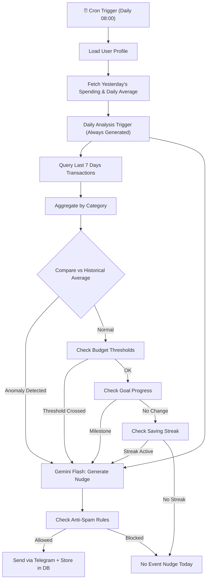

# Feature: Behavioral Nudge Engine

## Summary

The Behavioral Agent proactively analyzes spending patterns and sends personalized nudge messages via Telegram. It uses the user's profile (occupation, hobbies) to craft relatable, actionable advice — not generic warnings.

## User Story

> As a user, I want ChiWi to notice when I'm overspending and remind me using references I care about (photography gear, travel goals) so that I stay motivated.

## Nudge Types

| Type | Trigger Condition | Frequency |
|---|---|---|
| **Spending Alert** | Category spend exceeds weekly average by 30%+ | Max 1/day |
| **Budget Warning** | Budget usage ≥ 70% with ≥ 10 days remaining | Once per threshold |
| **Budget Exceeded** | Budget limit crossed | Immediate |
| **Goal Progress** | Milestone reached (25%, 50%, 75%) | Per milestone |
| **Saving Streak** | 3+ consecutive days below daily average | Once per streak |
| **Subscription Reminder** | Recurring charge detected (same amount, monthly) | 1 day before |
| **Impulse Detection** | 3+ unplanned purchases in 24 hours | Max 1/day |
| **Daily Analysis** | Every day at 08:00 (summary & insights for yesterday) | Daily |

## Personalization Strategy

The agent uses `user_profile` data to generate relatable analogies:

```
User Profile:
  occupation: "DevOps Engineer"
  hobbies: ["film_photography", "coffee"]
  financial_goals: { "camera_lens": 15M VND }
```

**Generic nudge** (bad): "Bạn đã chi quá nhiều cho cafe tuần này."

**Personalized nudge** (good): "☕ 500k cafe tuần này — bằng nửa cuộn Kodak Portra 400! Pha pour-over ở nhà tiết kiệm 400k/tuần, 1 tháng đủ mua 3 cuộn film 🎞️"

## Nudge Delivery Rules

| Rule | Value | Rationale |
|---|---|---|
| Max nudges per day | 2 | Avoid notification fatigue |
| No duplicate types in 24h | true | Prevent spam |
| Quiet hours | 22:00 - 07:00 | Respect user sleep |
| Delivery channel | Telegram silent message | Non-intrusive |
| User can snooze | 3 days / 7 days | Control over frequency |

## Behavioral Analysis Pipeline



## Effectiveness Tracking

Each nudge records user response for continuous improvement:

| Metric | How Measured |
|---|---|
| `was_read` | Telegram read receipt (if available) |
| `user_acted` | Spending in nudged category decreased next day |
| `dismissed` | User used "snooze" or "ignore" button |

## API Contract (Internal)

The Behavioral Agent is triggered by the scheduled worker, not by external API. It writes nudges to MongoDB and sends via Telegram Bot.

```python
class NudgeRequest(BaseModel):
    user_id: str
    nudge_type: str
    trigger_data: dict  # Aggregated spending data that triggered nudge

class NudgeResult(BaseModel):
    nudge_id: str
    message: str
    sent: bool
    blocked_reason: str | None  # e.g., "anti_spam_daily_limit"
```
