# ChiWi — Business Logic Flows

## 1. Transaction Ingestion Flow (Android → Stored Transaction)

The Android app is a **sensor only** — it captures the raw notification text and forwards it verbatim. All AI parsing happens server-side so bank format changes are fixed with a backend deploy, not a mobile release.

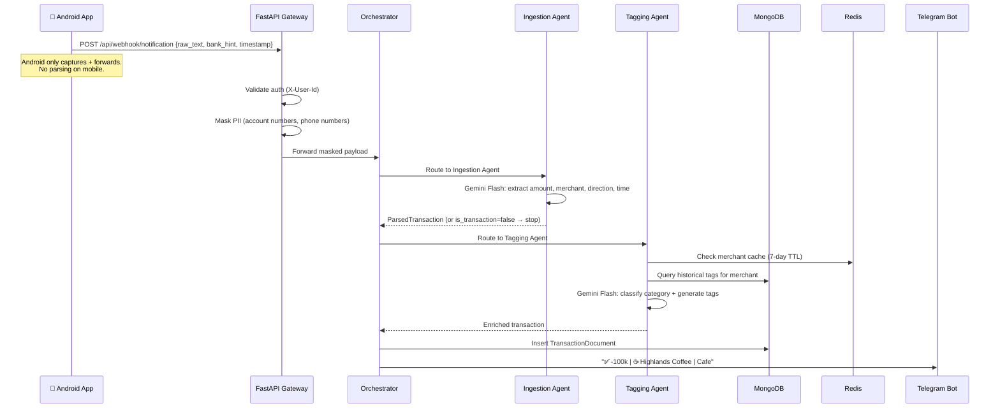

## 2. Chat-to-Transaction Flow (Natural Language → Transaction)

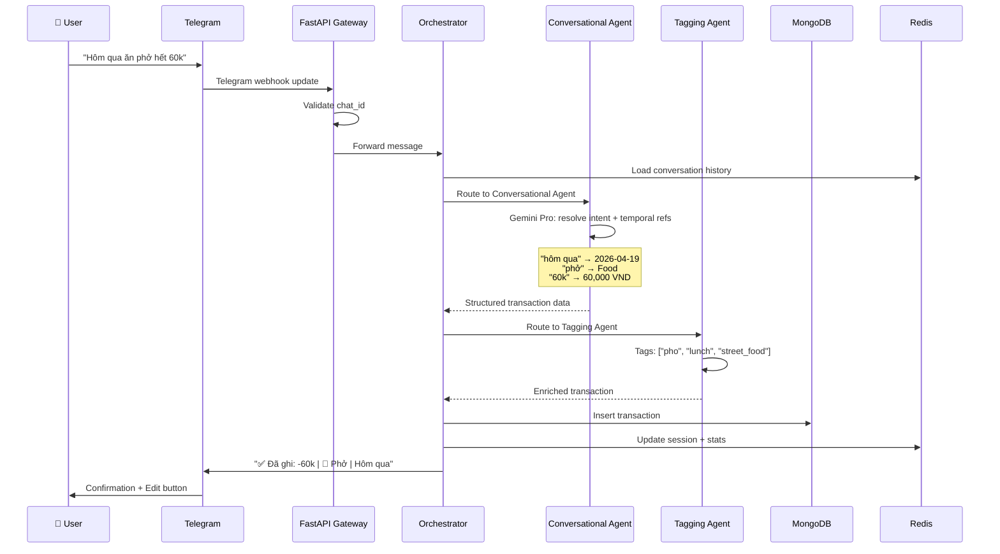

## 3. User Correction Flow

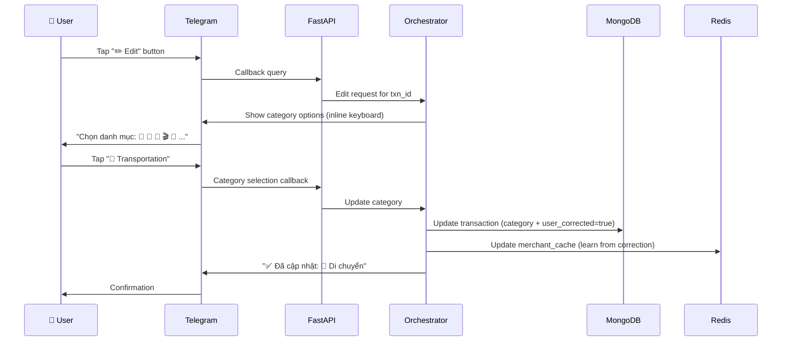

## 4. Behavioral Nudge Flow

Two entry points share the same `BehavioralAgent.analyze()` pipeline.

### 4a. Cron Worker Path (Scheduled)

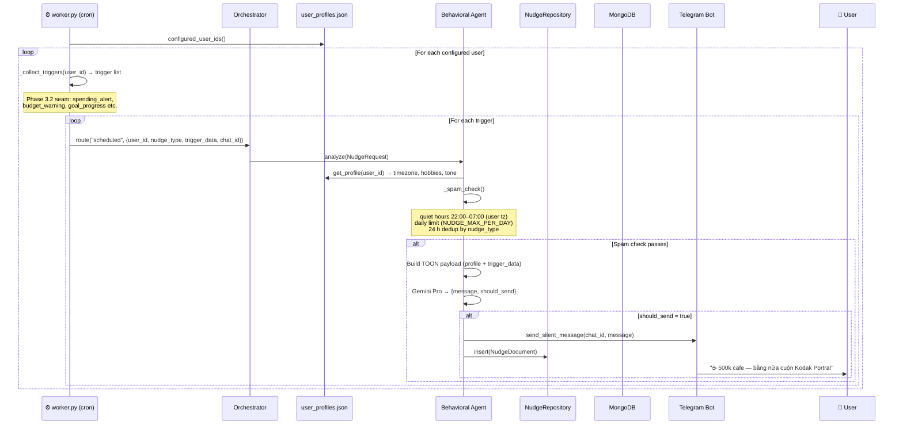

### 4b. Telegram Command Path (`/nudge`)

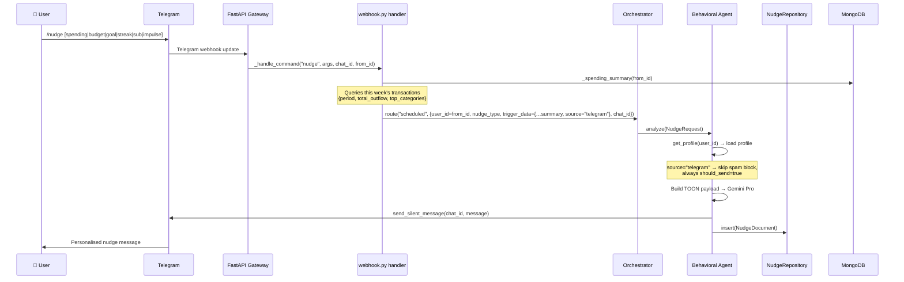

## 5. Report Generation Flow

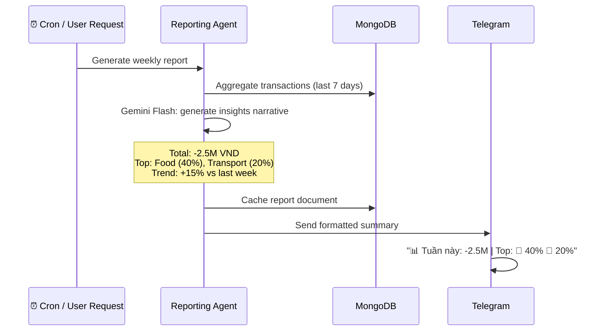

> Visual dashboard (charts, drill-downs) is out of scope for this repo — deferred to the Android app in a separate repository.

## 6. Voice Input Flow

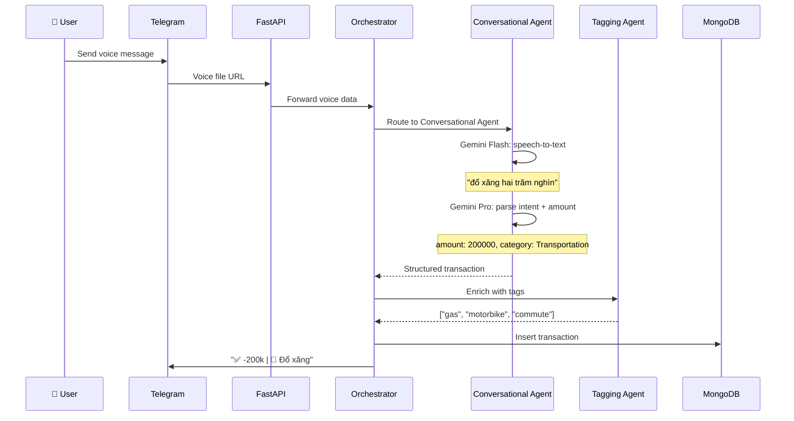

## 7. Subscription Management Flow

### 7a. Register a subscription (chat)

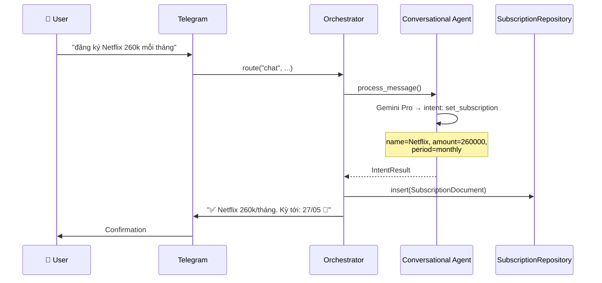

### 7b. Auto-detect unregistered recurring charge

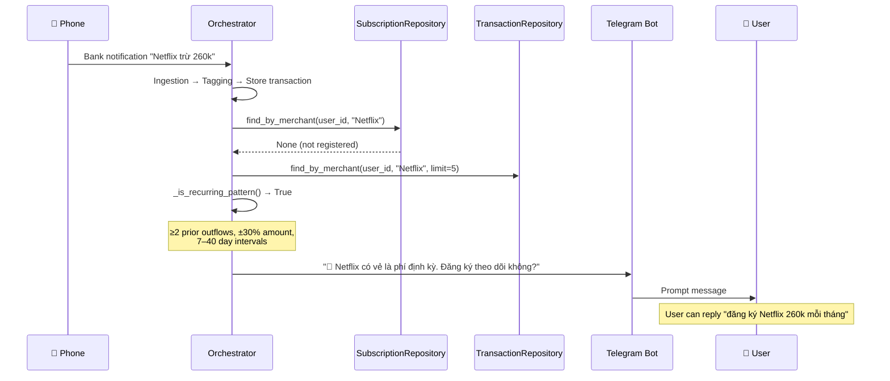

### 7c. Incoming charge matches registered subscription

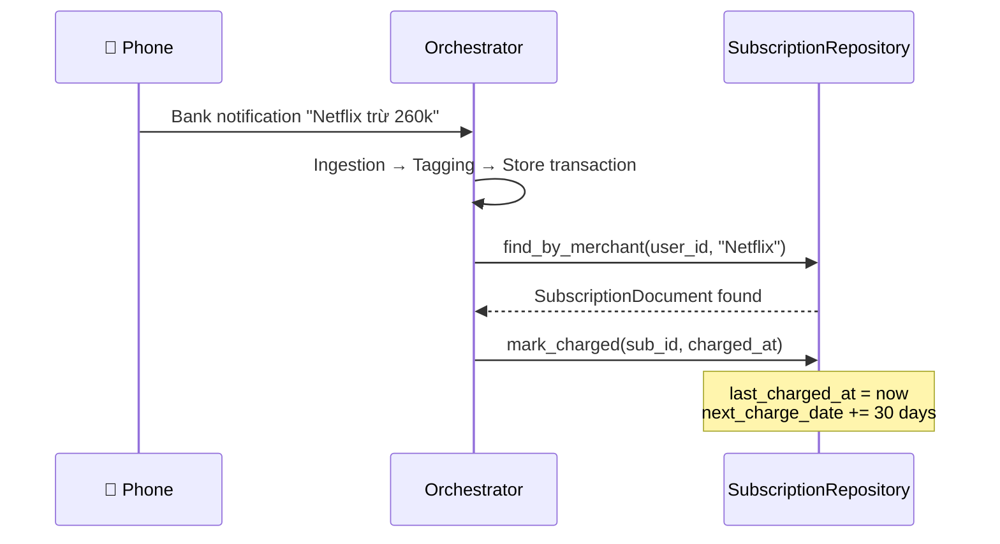

### 7d. Manual mark paid (chat)

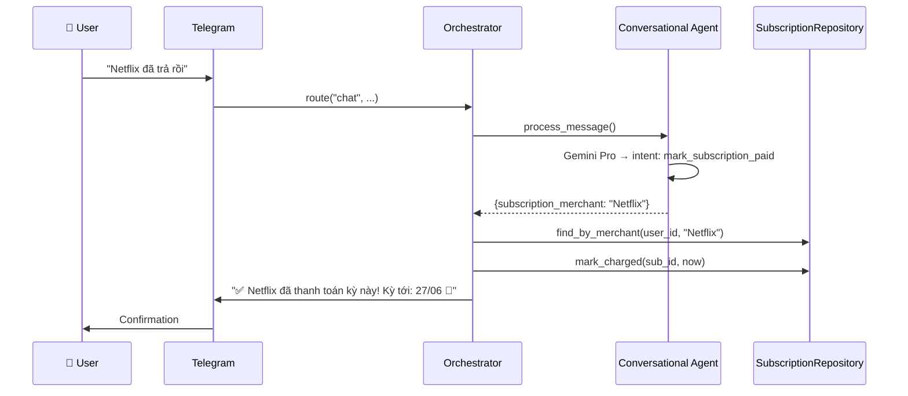

### 7e. Subscription reminder (cron)

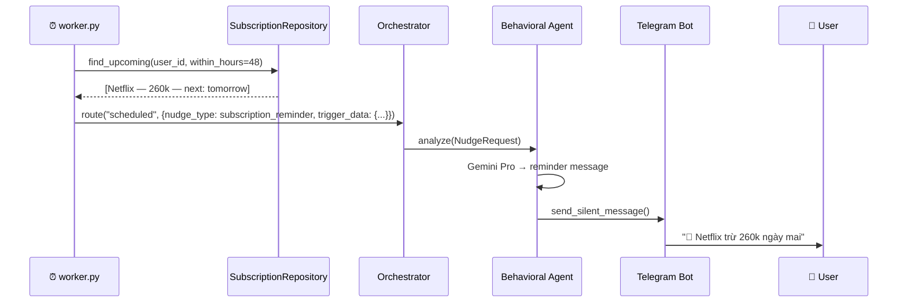

## 8. System Startup Flow

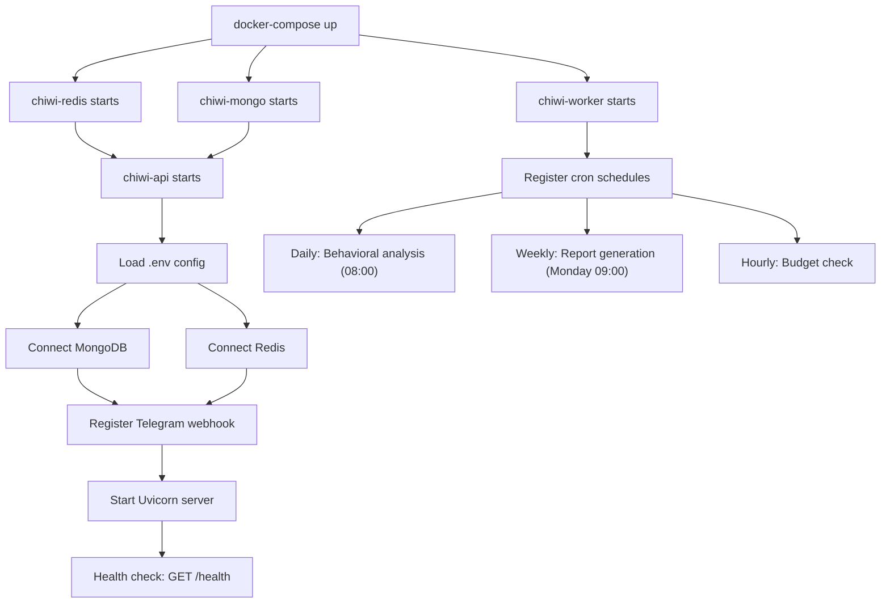

## 9. Analytics Flow (Comparison / Trend)

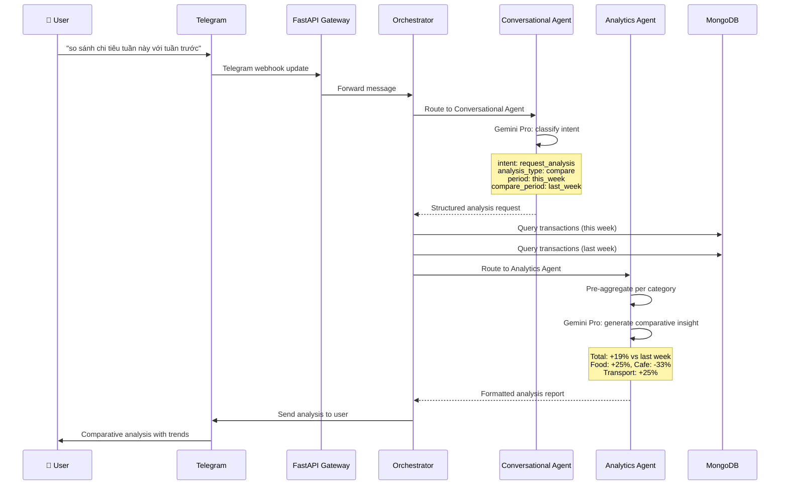

## 10. Budget Management Flows

### 10a. Set a budget (chat)

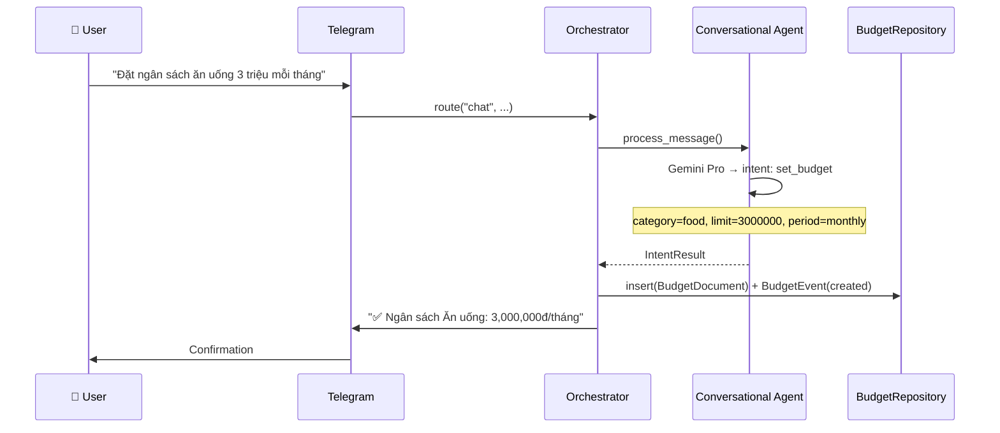

### 10b. View budgets (chat)

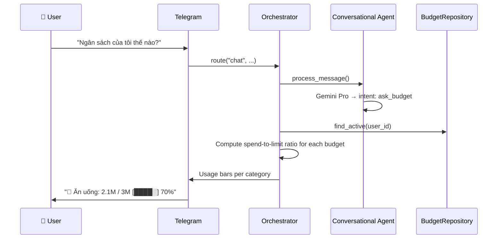

### 10c. Modify a budget (update / temp override / silence / disable)

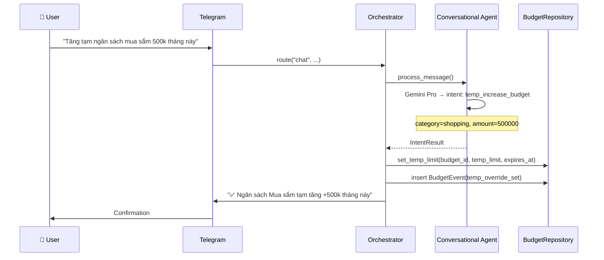

Other intents follow the same pattern:
- `update_budget` → updates `limit_amount` permanently + BudgetEvent(`limit_updated`)
- `silence_budget` → sets `is_silenced=True` + BudgetEvent(`silenced`); budget is still tracked but no alert nudges
- `disable_budget` → sets `is_active=False` + BudgetEvent(`disabled`)

## 11. Spending vs Average Flow

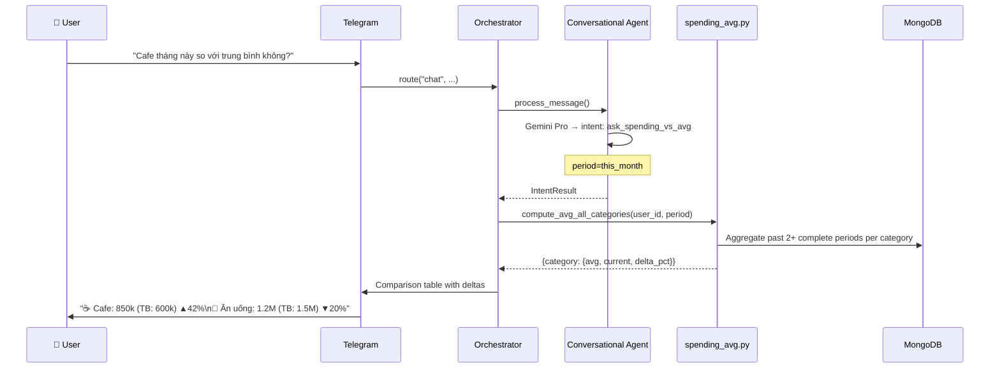
