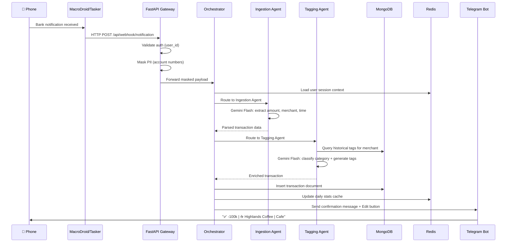
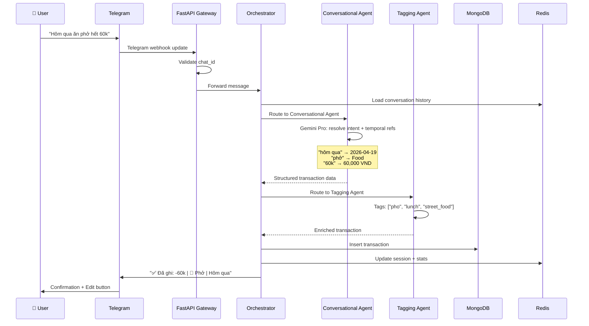
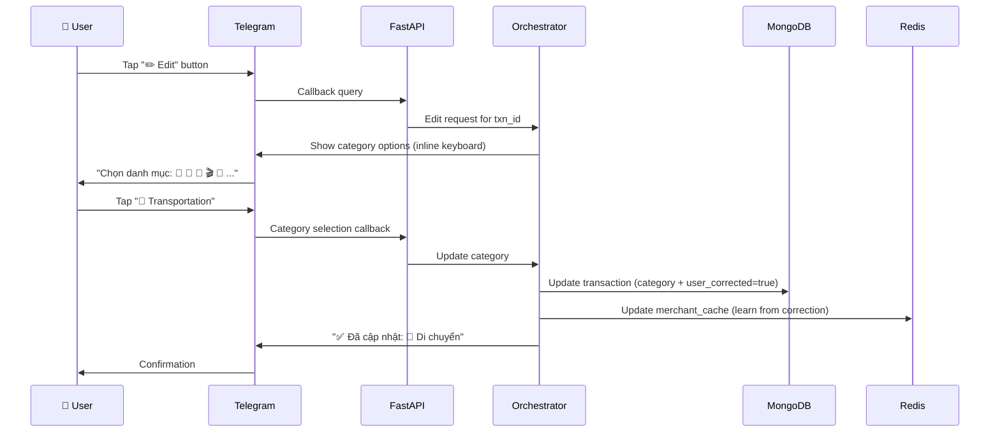
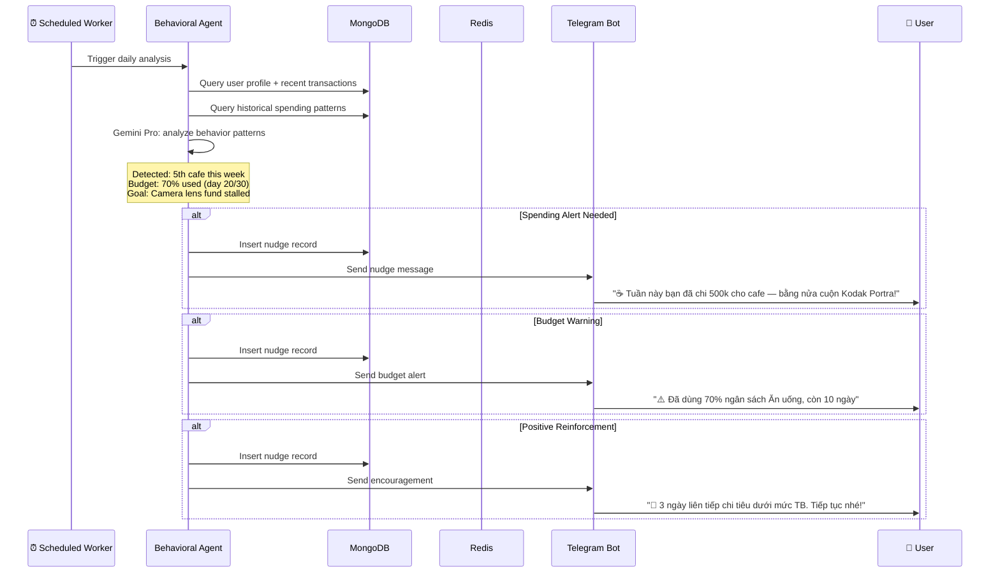
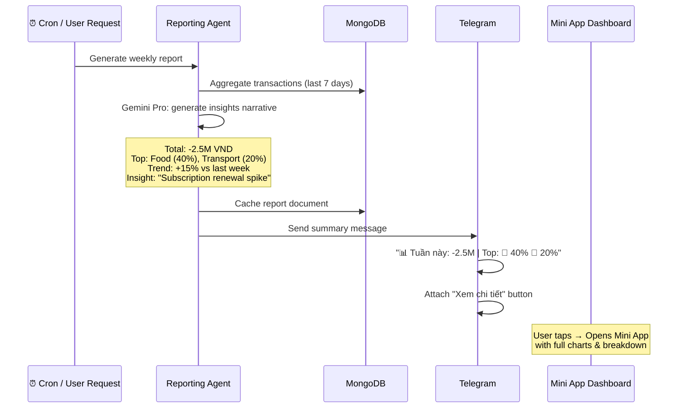
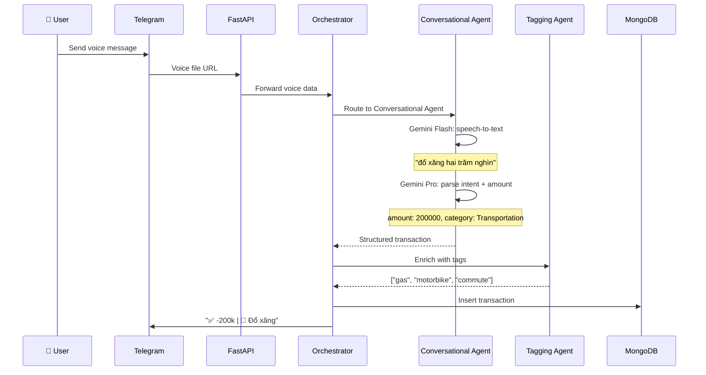
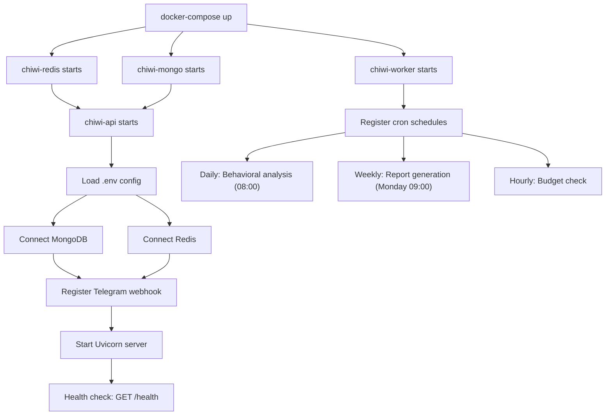

# ChiWi — Business Logic Flows

## 1. Transaction Ingestion Flow (Notification → Stored Transaction)

## 2. Chat-to-Transaction Flow (Natural Language → Transaction)

## 3. User Correction Flow

## 4. Behavioral Nudge Flow

## 5. Report Generation Flow

## 6. Voice Input Flow

## 7. System Startup Flow

